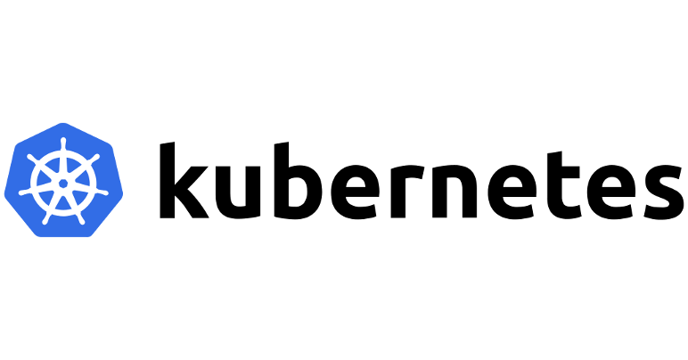

# Kubernetes -  Microservice(s) Log Extractor

#  Features!

  - Microservice Log extractor (Regardless of pods) - last hour, last day or all

### How to run

First Step - interactive user interface Script (supports ubuntu os):

* chmod +x LogExtractorBot.sh
* ./LogExtractorBot.sh

----
Want to contribute? Great!
 - [Connect ->  Hariom Vashisth](mailto:vashisth.hariom7@gmail.com)